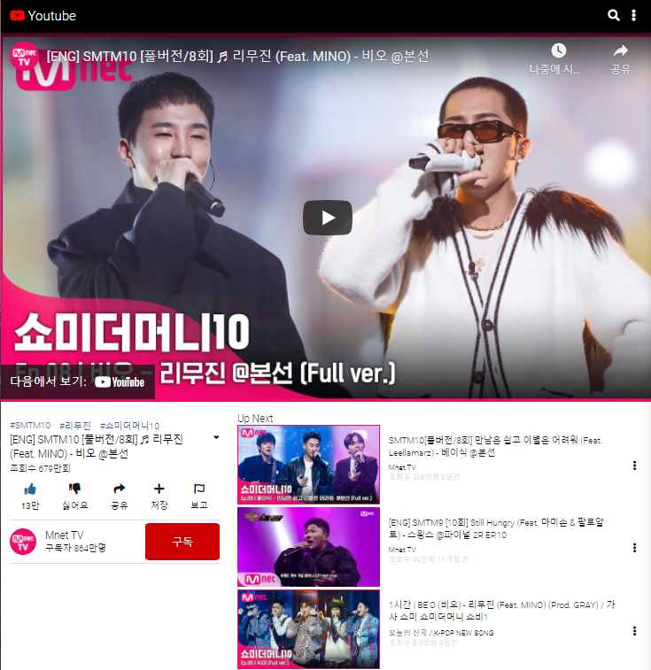

# 작업중

# npm 설치, 명령어

```
npm init
npm i react react-dom
npm i -D webpack webpack-cli
npm i -D @babel/core : 기본
npm i -D @babel/preset-env : 최신문법을 과거 브라우저에 맞게 지원
npm i -D @babel/preset-react : jsx를 사용할 수 있게 된다.
npm i -D babel-loader : babel과 webpack을 연결해준다.
npm i react-refresh @pmmmwh/react-refresh-webpack-plugin -D
npm i -D webpack-dev-server

  "scripts": {
    "dev": "webpack serve --env development"
  },
```

원래라면 이것들을 다 입력, 설치해주어야 하는데 사실상 불가능에 가깝다. 그래서 package.json, package-lock.js를 복붙해서 npm ci로 빠르게 시작

# Week 1




